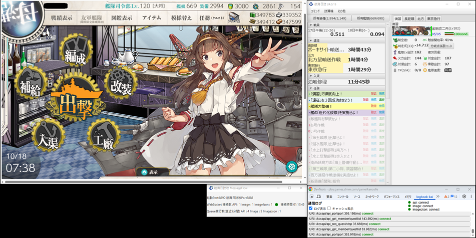

# logbook-kai-messageflow

### 概要

「艦隊これくしょん ～艦これ～」のSSL対応にて、ChromeExtensionから航海日誌改へ通信データを中継する外部ツールです。

### 動作イメージ

### [ダウンロード](https://github.com/sakura0689/logbook-kai-messageflow/releases)

### [環境設定(必須)](how-to-preference.md)

### 動作環境

Java17がインストールされたWindows,LinuxまたはmacOSが必要です。

**次のJavaVMで動作確認されています。**
- **[Liberica JDK version 17](https://bell-sw.com/pages/downloads/#jdk-17-lts)**
   - 新規に導入する場合、こちらを推奨します。
- [Oracle JDK 17](https://www.oracle.com/jp/java/technologies/downloads/)
   - ダウンロードにOTNアカウントが必要です。
   - 画面下部にJDK17のリンクがあります

次のJavaVMではご利用いただけません。
- バージョンが17ではないJavaVM

**Macの場合、追加でJavaFx SDKをインストールしてください**
- **[JavaFx version 17](https://gluonhq.com/products/javafx/)**

### ライセンス

* [The MIT License (MIT)](LICENSE)

MIT ライセンスの下で公開する、自由ソフトウェアです。