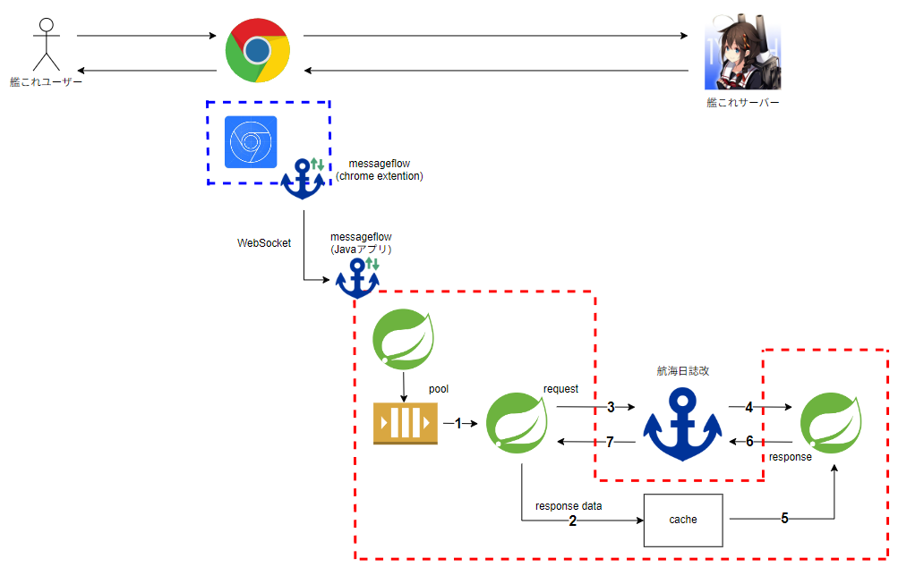
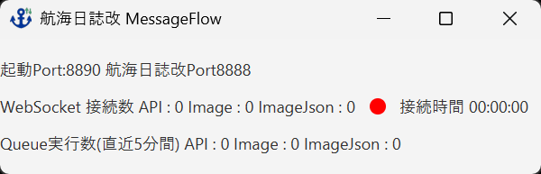
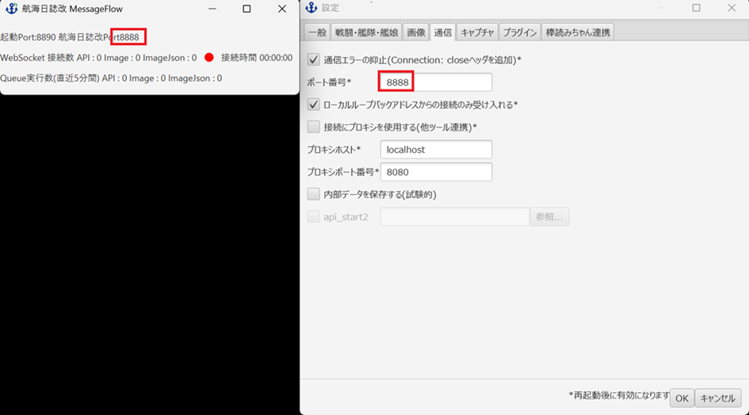
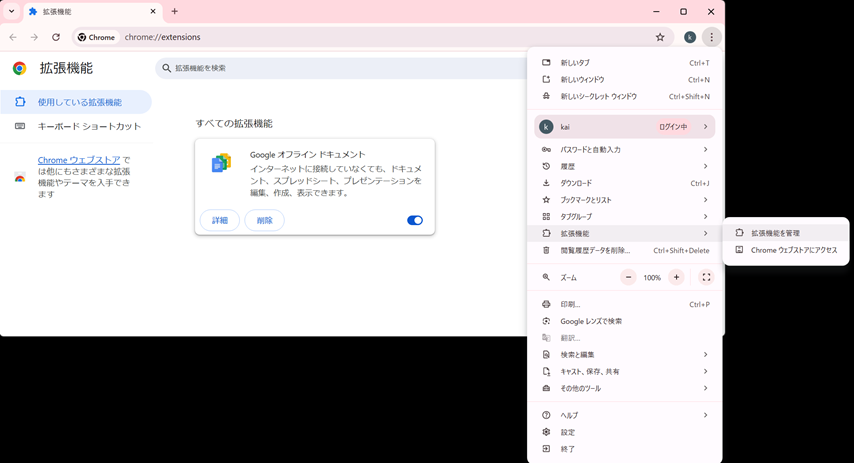
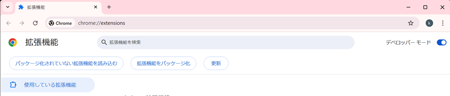
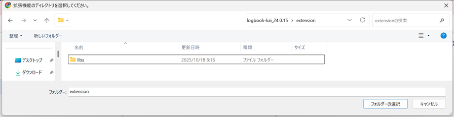
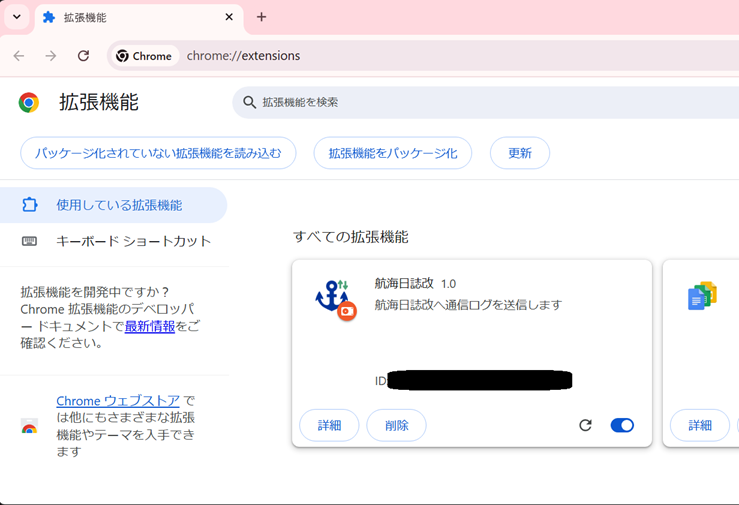
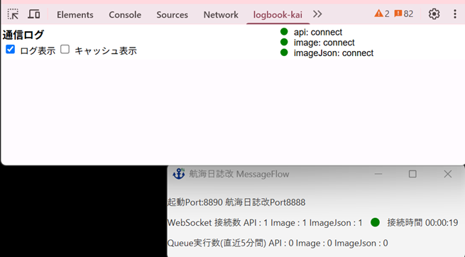

# logbook-kai-messageflow設定

航海日誌改を使用しながら艦これで遊ぶには、logbook-kai-messageflowの設定が必要となります。

logbook-kai-messageflowにはchrome extensionとJavaアプリケーションの両方のインストールが必要です。

### 動作イメージ

### ダウンロード

[releases](https://github.com/sakura0689/logbook-kai-messageflow/releases)

こちらから最新のファイルをダウンロードしてください

### セットアップ

extensionフォルダ

launch-messageflow.bat

logbook-kai-messageflow.jar

を航海日誌改のフォルダーにコピーします

### messageflow Javaアプリケーション

launch-messageflow.batをクリックします

起動すれば成功です

### Port設定確認

航海日誌改の [その他] → [設定] → [通信]を開き、messageflow Javaアプリケーションのポートと同じ設定となっていることを確認してください

航海日誌改を8888以外のportで動かしている方は、launch-messageflow.batの-Dkaiport=8888を修正してください

### messageflow chrome extensionのインストール

1)アドレスバーから chrome://extensions にアクセス

2)[拡張機能] -> [拡張機能を管理]

どちらかの方法にてchrome extensionの設定画面にアクセスします

### messageflow chrome extensionのインストール

[デベロッパー モード]をonにし、[パッケージ化されていない拡張機能を読み込む]ボタンを表示させます

[パッケージ化されていない拡張機能を読み込む]ボタンをクリックし、航海日誌改のextensionフォルダーを選択します

libsフォルダだけが表示されている状態で[フォルダーの選択]をクリックします

拡張機能に航海日誌改が追加されていればインストール成功です

### 起動

航海日誌改,logbook-kai-messageflowが起動している状態で、艦これの画面でF12を押しDevToolsを起動します

[logbook-kai]のパネルを選択し、DevToolsのAPIステータスが緑に、logbook-kai-messageflowの接続ステータスが緑になれば起動完了です

